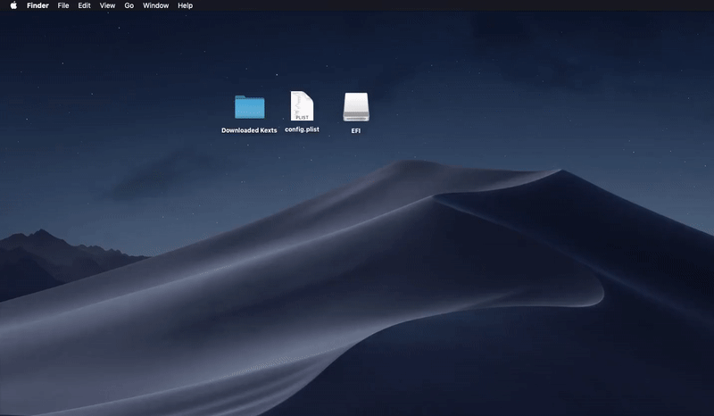

# Install and Configuring Clover in macOS

1. Open the Clover installer.
2. Install it to your USB with these settings. \(Choose Customize in `Installation Type` part\) **UEFI:** `Clover for UEFI booting only Install Clover in the ESP UEFI Drivers:  - ApfsDriverLoader  - OsxAptioFix3Drv  - VBoxHFS (or HFSPlus) Install RC Scripts on target volume (or Install RC Scripts on other volumes)` More explanations [here](https://hackintosh.gitbook.io/-r-hackintosh-vanilla-desktop-guide/clover-setup).
3. When it is finished, a disk call EFI should be mounted. Replace the original config.plist in EFI/EFI/CLOVER with the config.plist you've made.
4. After that, put all the kexts you have downloaded \(in [Gathering Kexts page](../../prerequisites/get-started/gathering-kexts.md)\) to `EFI/EFI/CLOVER/kexts/Other` folder.
5. You have finally made the installer! You can proceed to the [next part](../../actual-installation/actual-installation-part-1.md)! Yay! 🥳 

