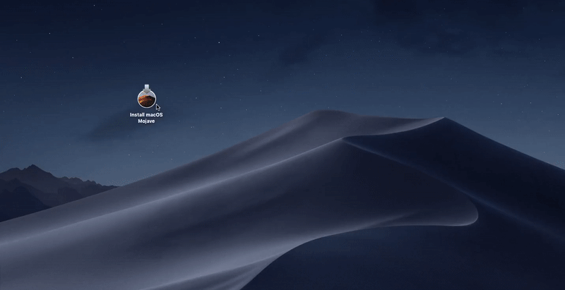

# From macOS

1. Format your USB with these settings: `Name: USB Format: MacOS Extended Journaled Scheme: GUID Partition Map`
2. Right click on your macOS installer app\(from the previous step\) and click `Show Contents Packages`.
3. Go to `Contents/Resources` and find `createinstallmedia` inside that folder.
4. Open Terminal.
5. Type `sudo [drag and drop createinstallmedia here] --volume /Volumes/USB` and enter.
6. Follow the instructions. Be patient as it will take a lot of time.
7. Go to this [page](../../clover-installtion/usb-clover/usb-clover-macos.md) after finishing this part.

