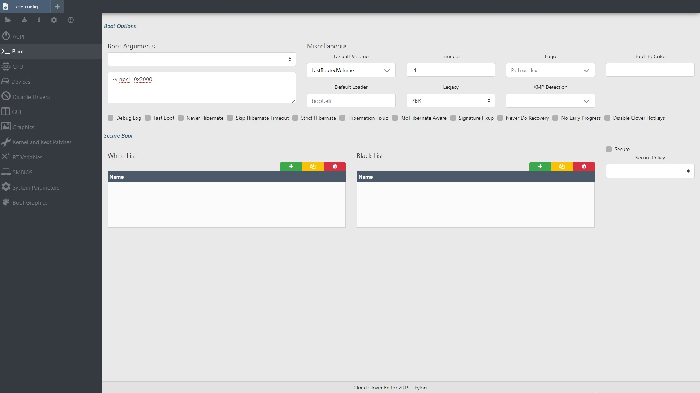

# AMD Clover config.plist

## 事先準備

* 請到 AMD OS X 的 Github 中 拿到 patches.plist \([Ryzen](https://raw.githubusercontent.com/AMD-OSX/AMD_Vanilla/master/17h/patches.plist), [FX](https://raw.githubusercontent.com/AMD-OSX/AMD_Vanilla/master/15h_16h/patches.plist), 右鍵另存新檔\)
* 使用 Clover Configurator \(CCG\) 或 [Clover Cloud Editor](http://cloudclovereditor.altervista.org/cce/index.php) \(CCE\) 打開 patches.plist


**如果你使用 CCE**, 請到主頁把_`Show Find/Replace/TgtBridge values as:`_設定為_`Hex`_


## ACPI

### RAW XML

```markup
<key>ACPI</key>
<dict>
	<key>DSDT</key>
	<dict>
		<key>Fixes</key>
		<dict>
			<key>DeleteUnused</key>
			<true/>
			<key>FixHPET</key>
			<true/>
			<key>FixRTC</key>
			<true/>
			<key>FixShutdown</key>
			<true/>
			<key>FixTMR</key>
			<true/>
			<key>FixIPIC</key>
			<true/>
		</dict>
		<key>Patches</key>
		<array>
			<dict>
				<key>Comment</key>
				<string>change SAT0 to SATA</string>
				<key>Disabled</key>
				<false/>
				<key>Find</key>
				<data>U0FUMA==</data>
				<key>Replace</key>
				<data>U0FUQQ==</data>
			</dict>
		</array>
	</dict>
	<key>FixHeaders</key>
	<true/>
</dict>
```

### **解釋**

**Patches:**

首先，我們先設定 _Patches_ 部分。這一部分讓我們能使用 Clover 動態地重新命名 DSDT 中的部件。由於我們並不是在運行一部真的 Mac, 而 macOS 對部件的命名比較特別，所以我們可以無傷地更改部件名稱令到它們對 Mac 友善。我們只需一個：

* _change SAT0 to SATA_（更改 SAT0 到 SATA）- 更好的 SATA 兼容性

**開啟 Fix Shutdown**

* 可以修複一些關機的問題，例如按關機卻重新開機的問題等等。但這個選項又可能會在某些主機板上造成關機問題（沒錯神奇不神奇），所以如果你在開啟後有關機問題的話，關掉這個

**開啟 Fix IPIC, TMR, HPET and RTC**

* 可以修複一些音頻的問題

### CCE 截圖


## Boot

### RAW XML

```markup
<key>Boot</key>
<dict>
	<key>Arguments</key>
	<string>-v npci=0x2000</string>
	<key>DefaultVolume</key>
	<string>LastBootedVolume</string>
	<key>Legacy</key>
	<string>PBR</string>
	<key>Timeout</key>
	<integer>-1</integer>
</dict>
```

### **解釋**

**Arguments:**

* **-v** - 開啟囉嗦模式，把所有_幕後的事情_ 都顯示出來，可以更容易地找出問題與修複它們
* **npci=0x2000** - 修複卡住在 \[PCI Configuration Start\].

**Default Volume** - 設定預設開機容器 

* **LastBootedVolume** - 讓 Clover 自動選擇上次開機的容器（不論有沒有成功）

**Timeout \(秒\)** - 設定自動開機前時間

* **-1** - 關閉自動開機

**Legacy \(PBR\)** - 讓 Clover 使用 PBR 去啟動 Legacy 系統

### CCE 截圖



## Boot Graphic & CPU

沒有東西做

## Devices

### RAW XML

```markup
<key>Devices</key>
<dict>
	<key>Audio</key>
	<dict>
		<key>ResetHDA</key>
		<true/>
	</dict>
	<key>USB</key>
	<dict>
		<key>Inject</key>
		<true/>
		<key>FixOwnership</key>
		<true/>
	</dict>
</dict>
```

### **解釋**

* **Reset HDA** - 在重新啟動時將編碼器重設回原設狀態，可預防在啟動到其他系統時的音頻問題
* **USB** - 在這一部分中，我們需確保 _Inject_ 和 _FixOwnership_ 都是開啟的，去防止在啟動時，卡在 `Enabling Legacy Matching` 。你亦可在 BIOS 中開啟 _XHCI Hand Off_

### CCE 截圖


## Disable Drivers <a id="disable-drivers"></a>

沒有東西做

## GUI

### RAW XML

```markup
<key>GUI</key>
<dict>
	<key>Scan</key>
	<dict>
		<key>Entries</key>
		<true/>
		<key>Linux</key>
		<true/>
		<key>Tool</key>
		<true/>
	</dict>
</dict>
```

### **解釋**

**Scan:**

在這頁中，雖一需調整的設定是 _Scan_ 我選擇了 _Custom_, 再開啟所有東西除了 _Legacy_ 和 _Kernel_. 這只是把一些不能啟動的容量給隱藏起來

### CCE 截圖


## Graphics

### RAW XML

```markup
<key>Graphics</key>
<dict>
	<key>Inject</key>
	<false/>
	<key>RadeonDeInit</key>
	<false/>
</dict>
```

**請根據** [**GPU Buyers Guide**](https://khronokernel-3.gitbook.io/catalina-gpu-buyers-guide/) **去設定關於顯示卡的設定**

## Kernel And Kexts Patches

Patches.plist（你正在編輯的）已經有了所有需要的內核補丁

* **AppleRTC（開啟）** - 確保在重啟時，BIOS 不會重設

### CCE 截圖


## Rt Variables and SMBIOS

### RAW XML \(Rt Variables\)

```markup
<key>RtVariables</key>
<dict>
	<key>BooterConfig</key>
	<string>0x28</string>
	<key>CsrActiveConfig</key>
	<string>0x3e7</string>
	<key>ROM</key>
	<string>UseMacAddr0</string>
</dict>
```

### **解釋**

**RT Variables:**

我們把 _Rt Variables -&gt; ROM_ 設定為 `UseMacAddr0` 去讓系統使用在自己主機版 MAC 地址 － 應該是獨一無二的

_BooterConfig_ 被設定為 `0x28`, 和 _CsrActiveConfig_ 被設為 `0x3e7` 去禁用 SIP **因為在SIP 是在 AMD 平台上不支持的**

**SMBIOS:** 請略過

### CCE 截圖


## System Parameters

### RAW XML

```markup
<key>SystemParameters</key>
<dict>
	<key>InjectKexts</key>
	<string>Yes</string>
	<key>InjectSystemID</key>
	<true/>
</dict>
```

### **解釋**

**Inject Kexts:**

此設定有3個模式

* `Yes` - 讓 Clover 去從 EFI 中加載 kexts
* `No` - 讓 Clover **不**去從 EFI 中加載 kexts
* `Detect` - 讓 Clover 去判斷 kexts 快取是否包含 FakeSMC.kext 或 VirtualSMC.kext, 如果不包含就加載 kexts

需設定為 `Yes` 確保所有 kexts 會被加載

**Inject System ID:**

讓 Clover 在啟動時用 SmUUID 設定 `system-id` 對 iMessage 等非常重要

**NvidiaWeb:**

在每次啟動時強制加載 `nvda_drv=1` 如果你在安裝 Nvidia WebDrivers 後仍然使用預設的，開啟這個

### CCE 截圖


## 保存及離開

使用 _File -&gt; Save_ 去保存你的 config.plist \(如果你在使用 CCE, 返回主頁並下載你的 config.plist\). 保存到你會記得的地方

保存後，請到下一頁進行 SMBIOS 的設定

