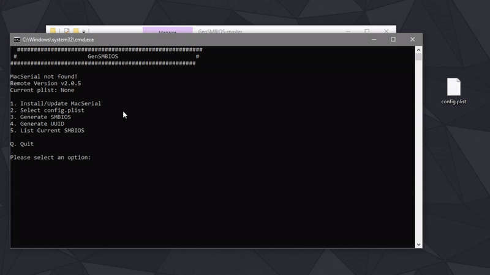
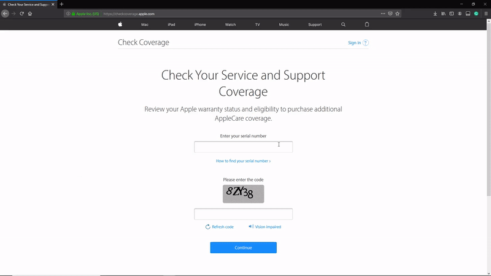

# SMBIOS

1. Prepare your config.plist which you've made.
2. Download or clone the whole repo of [GenSMBIOS](https://github.com/corpnewt/GenSMBIOS).
3. Open the folder and open GenSMBIOS.bat \(on Windows\) or right-click open GenSMBIOS.command \(on macOS\)
4. Enter 1 and enter. \(for update/install MacSerial\)
5. Then enter 2 and enter.
6. Drag and drop your config.plist and press enter.
7. Y.
8. Enter 3 and enter.
9. Enter the SMBIOS you want to generate and enter the number of SMBIOS amount. Press enter. **For AMD System,** here is the list of SMBIOS recommended from the most to the least: - _**iMacPro1,1**_ \(most recommended\) - _**iMac14,2**_ ****\(also recommended\) - MacPro6,1 \(a little bit old but it works\) - MacPro5,1 \(outdated and already lost support on Catalina\) - Other SMBIOS \(not recommended as they might cause problems\)
10. The first SMBIOS will be flushed into your chosen config.plist.
11. Go to [this website](https://checkcoverage.apple.com/) to check if your serial number is valid or not. We want a _**invalid**_ serial number.
12. If you get an invalid serial number, finish. If not, redo the whole proccess until you have a _**invalid**_ serial number.

