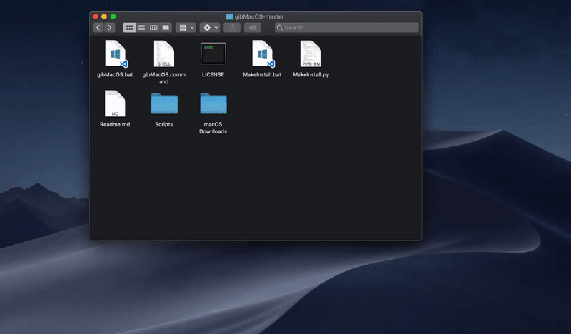

# From macOS \(Network Installer\)

1. Rename the downloaded `RecoveryHDMetaDMG.pkg (or RecoveryHDUpdate.pkg)` to `RecoveryHDMetaDMG.dmg (or RecoveryHDUpdate.dmg)`
2. Double click on it and a new disk call RecoveryHDMeta \(or RecoveryHDUpdate\) should be mounted
3. Go into the RecoveryHDMeta \(or RecoveryHDUpdate\) disk and copy BaseSystem.dmg to desktop.
4. Go to disk utility. Click **View &gt; Show all devices** and find your USB **\(the whole disk instead of a partition, check out the gif below to know what I am talking\)** and format it to:  `Name:   [whatever you want] Format: Mac OS Extended (Journaled)  Scheme: GUID Partition Map`
5. Now, choose your **USB partition** click Restore button in Disk Utility and choose Image...
6. Choose BaseSystem.dmg on desktop and press Restore.
7. This should take some time depending on your USB speed.
8. Go to this [page](../preparing-the-installer-part-3/install-and-configuring-clover-in-macos.md) after finishing this part.

