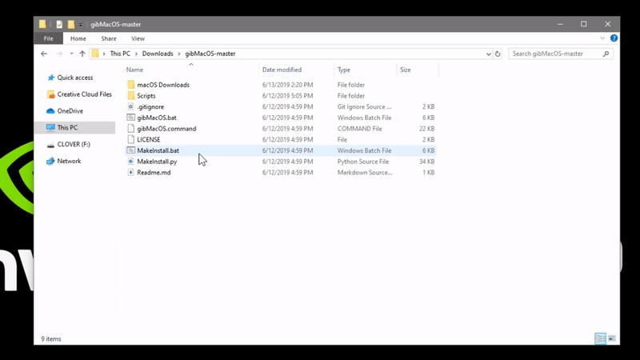
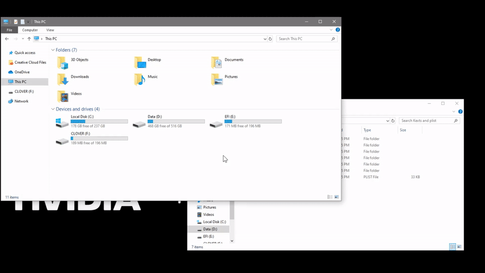
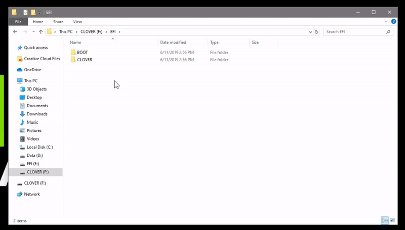

# From Windows \(Network Installer\)

#### **You'll need an ethernet connection while installing macOS with this method. For people who don't have an ethernet connection, please go to** [**this page**](from-windows-direct-download/convert-the-installer-to-offline.md) **after finishing this part to convert it to an offline installer.**

1. Now, run MakeInstall.bat inside the gibMacOS folder.
2. A Command Prompt window should pop up. Your USB should be listed. Enter the number in front of your USB and press Enter.
3. It will format your USB. After that, shift + right click and copy the path of the downloaded macOS package `gibMacOS/macOS Downloads/publicrelease/xxx-xxxxx - xx.xx.x macOS xxxx/RecoveryHDMetaDmg(or RecoveryHDUpdate)`

    to the cmd window and press enter.

4. It will start to extract the resources and restore them to your USB drive. This will take some time depending your USB speed. Be patient \(again\)!
5. After restoring the resources, the script will automatically install Clover \(boot-loader\) to your USB.
6. Once finished, you should be able to see a new partition called `CLOVER` is mounted. Go into `CLOVER/EFI/CLOVER`. Replace the original one with the config.plist you've made \(**AMD Users:** Use the pre-patched config that mentioned [here](../get-started/untitled/amd-clover-config.plist.md)\).
7. After that, put all the kexts you have downloaded \(in [Gathering Kexts page](../get-started/untitled/gathering-kexts.md)\) to `CLOVER/EFI/CLOVER/kexts/Other` folder.
8. Go back to `CLOVER/EFI/CLOVER` and go to the drivers64UEFI folder.
9. Delete everything except ApfsDriverLoader-64.efi.
10. Go back to `CLOVER/EFI/CLOVER` and go to `Drivers-off/drivers64UEFI` folder.
11. Copy `HFSPlus.efi`and `AptioMemoryFix-64.efi` to `CLOVER/EFI/CLOVER/drivers64UEFI`.
12. Yay! You are ready to [install macOS](../actual-installation-part-1.md)! 🥳 

